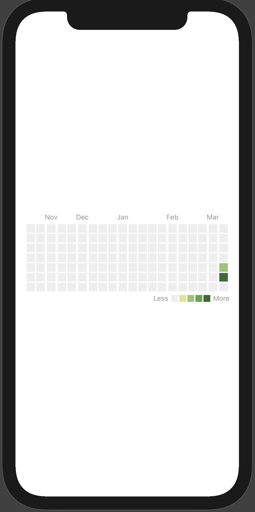

# ActivityView

Swift package for displaying activity charts, which imitate from the Github personal homepage.

### Installation:

It requires iOS 13 and Xcode 11!

In Xcode go to `File -> Swift Packages -> Add Package Dependency` and paste in the repo's url: `https://github.com/MissLIBRA97/ActivityViewSwiftUI`

### Usage:

import the package in the file you would like to use it: `import ActivityView`

You can display a activity chart by adding a chart view to your parent view:

``` swift
import SwiftUI
import ActivityView

struct ContentView: View {
    var data : ActivityViewData
    
    var body: some View {
        ActivityView(data: data, showLegend: true)
    }
}

struct ContentView_Previews: PreviewProvider {
    static var previews: some View {
        let data = [ActivityItem(date: Date(), duration: 50),ActivityItem(date: Date().addingTimeInterval(TimeInterval(-86400)), duration: 30)]
        let chartData = ActivityViewData(weeksNumber: 20, activeChartItems: data)
        ContentView(data: chartData)
    }
}
```


